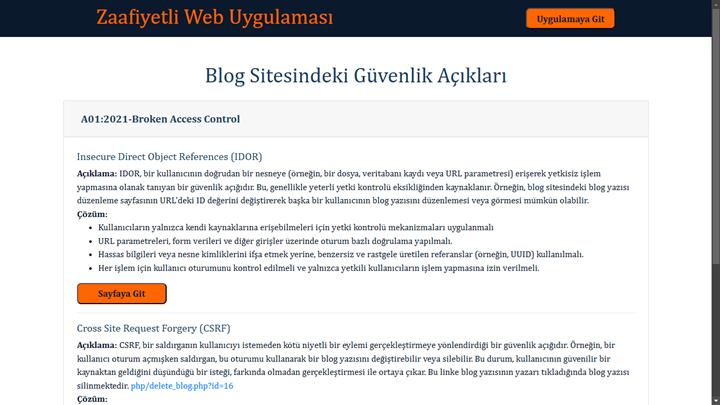

# Zaafiyetli-Web-Uygulmasi

## 1. Giriş  
### 1.1. Projenin Amacı  
Bu projenin amacı, web uygulamalarında sıklıkla karşılaşılan güvenlik zafiyetlerini anlamak ve analiz etmektir. OWASP Top Ten listesinde yer alan güvenlik açıklarını temel alarak, gerçek dünyaya yakın bir web uygulaması geliştirilmiştir.

---

## 2. Teknoloji ve Altyapı  
### 2.1. Kullanılan Teknolojiler  
- **Programlama Dili:** PHP  
- **Veritabanı Yönetim Sistemi:** MySQL  
- **Sunucu:** Apache (XAMPP)  
- **Önyüz Teknolojileri:** HTML, CSS, Bootstrap  

---

## 3. Uygulama Yapısı  

### 3.1. Ana Sayfa  
Proje hakkında genel bilgiler ve OWASP Top Ten listesinde yer alan güvenlik açıklarına yönelik açıklamalar sunar.

### 3.2. Üye Ol Sayfası  
Kullanıcıların sisteme kayıt olmasını sağlayan formu içerir.

### 3.3. Giriş Yap Sayfası  
Kullanıcı adı ve şifre doğrulama işlemi gerçekleştirilir.

### 3.4. Bloglar Sayfası  
Tüm kullanıcıların blog yazılarının görüntülenebildiği bir sayfadır.

### 3.5. Blog Ekle Sayfası  
Kullanıcılardan blog yazısı bilgileri ve resim dosyası alınarak sisteme ekleme yapılır. Ayrıca XML formatında blog ekleme desteği sunulmaktadır.

### 3.6. Bloglarım Sayfası  
Kullanıcıların yalnızca kendi bloglarını görüntüleyebildiği, düzenleyebildiği veya silebildiği bir bölüm sunar.

### 3.7. Blog Görüntüleme Sayfası  
Blog yazısının detaylarını görüntüleme ve yazıya yorum yapma imkanı sunar.

### 3.8. Parola Güncelle Sayfası  
Kullanıcıların mevcut parolalarını değiştirebilecekleri bir form bulunur.

---

## 4. Veritabanı Yapısı  

Bu proje kapsamında kullanılan MySQL veritabanı, üç ana tabloya sahiptir:  
- **Blogs:** Blog yazılarını saklar.  
- **Comments:** Bloglara yapılan yorumları saklar.  
- **Users:** Kullanıcı bilgilerini saklar ve kimlik doğrulama işlemleri için kullanılır.  

---

## 5. Güvenlik Açıkları Analizi  

### 5.1. Broken Access Control (Erişim Kontrol Zafiyetleri)  

#### 5.1.1. IDOR (Insecure Direct Object References)  
- **Açıklama:** Yetkisiz kullanıcıların URL parametrelerinde ID gibi verilere müdahale ederek başka kullanıcıların kaynaklarına erişim sağlayabileceği bir güvenlik açığıdır.  
- **Örnek:** Bir kullanıcının blog düzenleme URL’sindeki `id` parametresini değiştirerek başka bir kullanıcının blogunu düzenlemesi.  
- **Çözüm Önerileri:**  
  - Her işlemde kullanıcı oturumu kontrol edilmelidir.  
  - Nesne kimliklerini doğrudan ifşa etmek yerine benzersiz referanslar (UUID) kullanılmalıdır.  
  - URL parametreleri ve form verileri üzerinde yetki kontrolü uygulanmalıdır.  

#### 5.1.2. Cross-Site Request Forgery (CSRF)  
- **Açıklama:** Kullanıcının oturum açmış olduğu bir sistemde farkında olmadan saldırganın yönlendirdiği işlemleri gerçekleştirdiği bir güvenlik zafiyetidir.  
- **Örnek:** Kullanıcı oturumu açıkken saldırganın yönlendirdiği bir bağlantıya tıklaması sonucunda bir blog yazısının silinmesi (`php/delete_blog.php?id=16`).  
- **Çözüm Önerileri:**  
  - Benzersiz CSRF token'ları kullanılarak işlemler doğrulanmalıdır.  
  - Token doğrulama işlemleri sunucu tarafında yapılmalıdır.  
  - Kullanıcı oturumları için benzersiz oturum ID’leri oluşturulmalıdır.  

---

### 5.2. Cryptographic Failures (Kriptografik Zafiyetler)  

#### 5.2.1. Düz Metin Olarak Şifre Saklama  
- **Açıklama:** Kullanıcı şifrelerinin veritabanında düz metin olarak saklanması, veri ihlali durumunda ciddi güvenlik riskleri oluşturur.  
- **Çözüm Önerileri:**  
  - Şifreler, SHA1 veya bcrypt gibi hash algoritmaları ile saklanmalıdır.  
  - Salting yöntemi ile hash değerleri benzersiz hale getirilmelidir.  

---

### 5.3. Injection (Enjeksiyon Zafiyetleri)  

#### 5.3.1. SQL Enjeksiyonu (SQL Injection)  
- **Açıklama:** Kullanıcı verilerinin doğrudan SQL sorgularına dahil edilmesi, saldırganların kötü niyetli girişlerle veritabanını manipüle etmesine olanak sağlar.  
- **Örnek:** Kullanıcı giriş yap sayfasında parola bölümüne `' OR '1'='1` yazarak oturum açabilir.  

#### 5.3.2. Cross-Site Scripting (XSS)  
- **Açıklama:** Kullanıcıdan alınan girdilerin çıktıda filtrelenmeden sunulması sonucunda, saldırganların kötü niyetli JavaScript kodları çalıştırmasına imkan tanır.  
- **Örnek:** Blog yorum bölümüne `` eklenmesi ve çalıştırılması.  
- **Çözüm Önerileri:**  
  - Tüm kullanıcı girdileri doğrulanmalı ve temizlenmelidir.  
  - Çıktılar `htmlspecialchars()` gibi fonksiyonlarla kodlanmalıdır.  

---

### 5.4. Security Misconfiguration (Güvenlik Yanlış Yapılandırmaları)  

#### 5.4.1. Dosya Yükleme Zafiyeti  
- **Açıklama:** Kullanıcıların zararlı dosyalar (örneğin, kötü amaçlı PHP scriptleri) yükleyerek sunucuyu manipüle etmesine olanak sağlar.  
- **Örnek:** Blog yazısı ekleme sayfasındaki resim yükleme yerine farklı türde dosyalar yüklenmesi.  
- **Çözüm Önerileri:**  
  - Yalnızca belirli dosya türlerine izin verilmelidir.  
  - Dosya türleri ve içerikleri MIME türü doğrulaması ile kontrol edilmelidir.  
  - Yüklenen dosyaların isimleri rastgele oluşturulmalıdır.  

---

## 6. Sonuç  
Bu uygulama, güvenlik açıklarını anlamak ve etkilerini test etmek için etkili bir platform sunmaktadır. Proje, hem güvenlik araştırmacılarının hem de geliştiricilerin bilgi birikimini artırmayı amaçlamaktadır.
